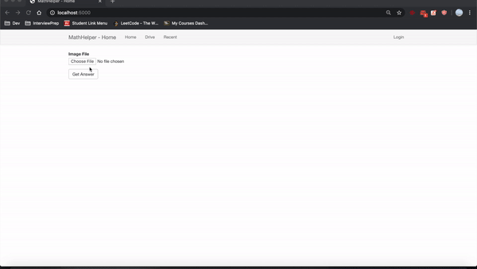

# MathHelper

Take a picture of the math problem you are struggling with and upload it either from your computer or Google Drive to get the anwser!

Used Mathpix API for image to math formula processing and wolfram alpha for solution of the quesiton.

Used Flask for framework and SQLite for database, also enabled user to upload from Google with Google Drive API.

# Demo:
s